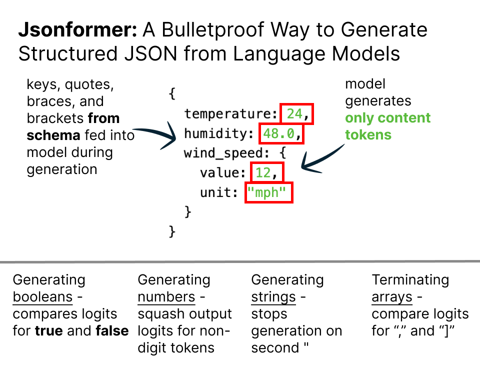

# Jsonformer: A Bulletproof Way to Generate Structured JSON from Language Models.

## Problem: Getting models to output structed JSON is hard

## Solution: Only generate the content tokens and fill in the fixed tokens



Generating structured JSON from language models is a challenging task. The
generated JSON must be syntactically correct, and it must conform to a schema
that specifies the structure of the JSON.

Current approaches to this problem are brittle and error-prone. They rely on prompt engineering, fine-tuning, and post-processing, but they still fail to generate syntactically correct JSON in many cases.

## Example

```python
from transformers import AutoModelForCausalLM, AutoTokenizer

model = AutoModelForCausalLM.from_pretrained("databricks/dolly-v2-12b")
tokenizer = AutoTokenizer.from_pretrained("databricks/dolly-v2-12b")

schema = {
    "type": "object",
    "properties": {
        "name": {"type": "string"},
        "age": {"type": "number"},
        "is_student": {"type": "boolean"},
        "courses": {
            "type": "array",
            "items": {"type": "string"}
        }
    }
}

prompt = "Generate a person's information based on the following schema:"
jsonformer = Jsonformer(model, tokenizer, json_schema, prompt)
generated_data = jsonformer()

print(generated_data)
```

Jsonformer is a new approach to this problem. In structured data, many tokens are fixed and predictable. Jsonformer is a wrapper around HuggingFace models that fills in the fixed tokens during the generation process, and only delegates the generation of content tokens to the language model. This makes it more efficient and bulletproof than existing approaches.

This currently supports a subset of JSON Schema. Below is a list of the supported schema types:

- number
- boolean
- string
- array
- object

## Features

- Bulletproof JSON generation: Jsonformer ensures that the generated JSON is always syntactically correct and conforms to the specified schema.
- Efficiency: By generating only the content tokens and filling in the fixed tokens, Jsonformer is more efficient than generating a full JSON string and parsing it.
- Flexible and extendable: Jsonformer is built on top of the HuggingFace transformers library, making it compatible with any model that supports the HuggingFace interface.

## Usage

To use Jsonformer, you need to provide a language model, a tokenizer, a JSON schema, and a prompt. Optionally, you can enable debugging, and set the maximum array length for generated arrays.

```python
from transformers import PreTrainedModel, PreTrainedTokenizer
from typing import Dict, Any
from jsonformer import Jsonformer

jsonformer = Jsonformer(model, tokenizer, json_schema, prompt, debug=True, max_array_length=10)
generated_data = jsonformer()
```

## License

Jsonformer is released under the MIT License. You are free to use, modify, and distribute this software for any purpose, commercial or non-commercial, as long as the original copyright and license notice are included.
